# NRU RANEPA (Timetable)

Experience the power of seamless cross-platform integration with our Flutter-based mobile client, expertly crafted by NRU RANEPA. This custom solution redefines versatility and opens up endless possibilities for your mobile experience.

## Features

* iOS today extension and android app widget
* Platform adaptive design (using CupertinoApp & MaterialApp)
* Caching support
* Multicolor themes with dark & light app appearance
* Multiple site api's support
* Fully internationalization
* Customizable timetable app design
* Cool intro screen
* iOS & Android calendar integration
* Android alarm clock integration

<p float="left">
    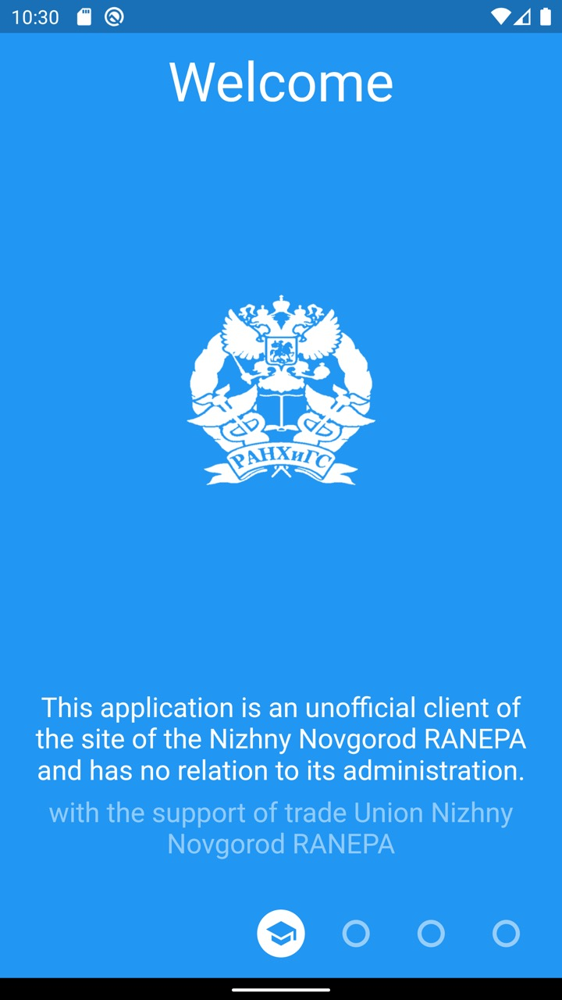
    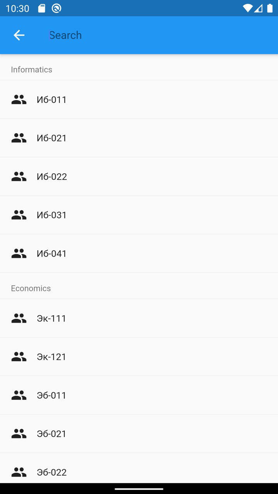
    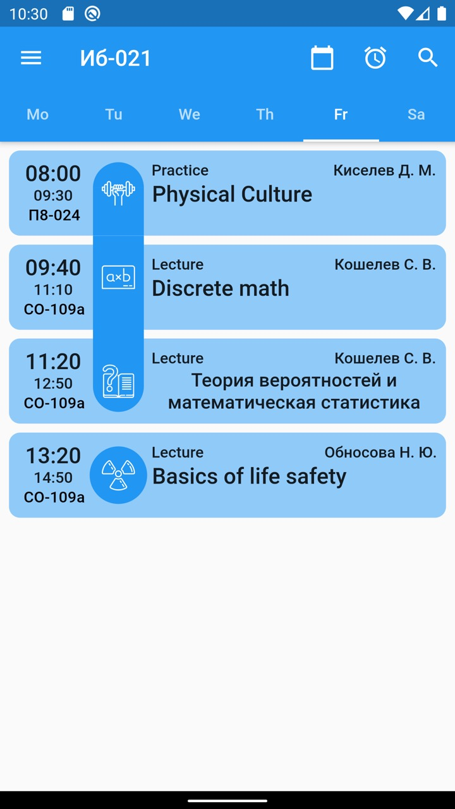
    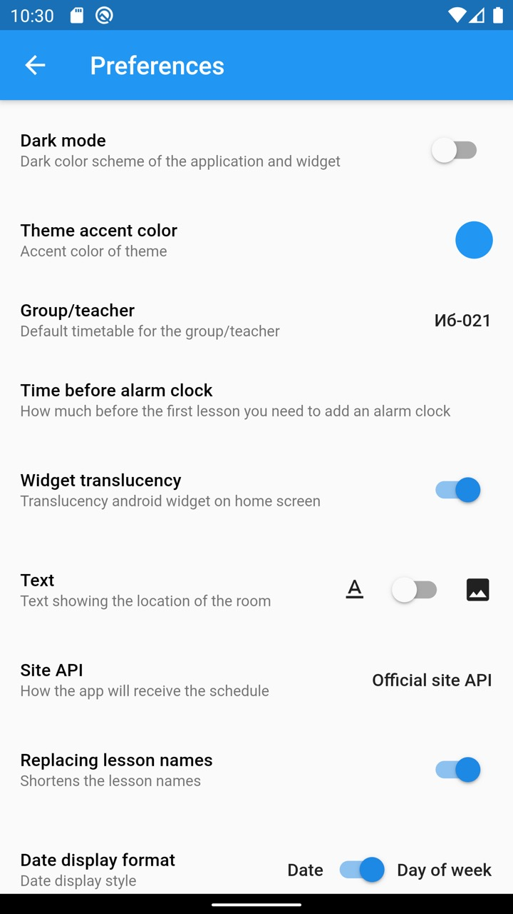
    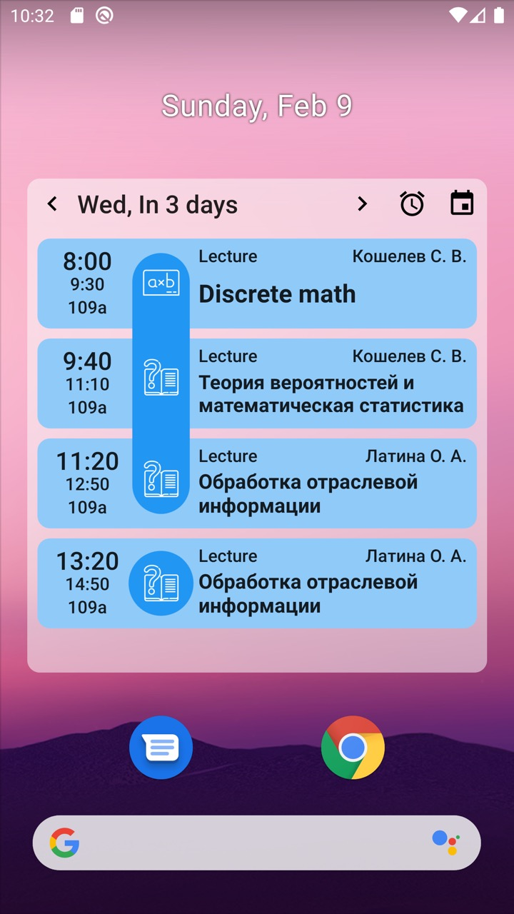
</p>

<p float="left">
    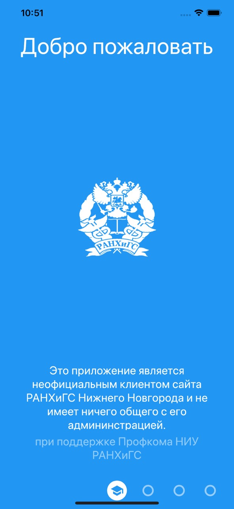
    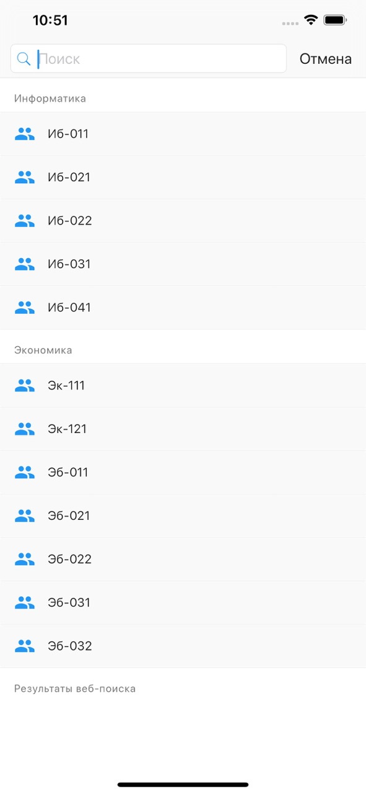
    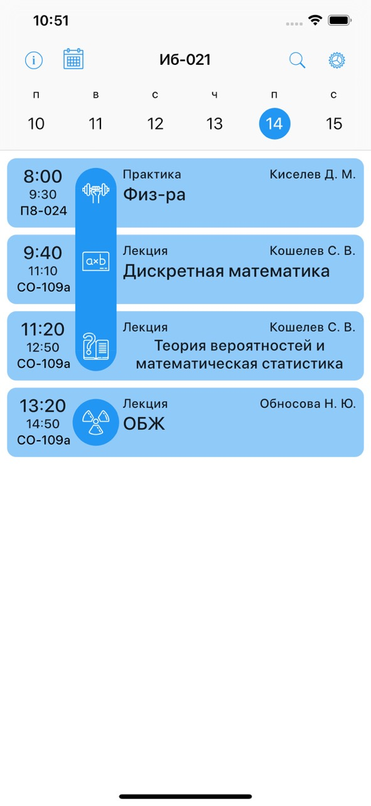
    
    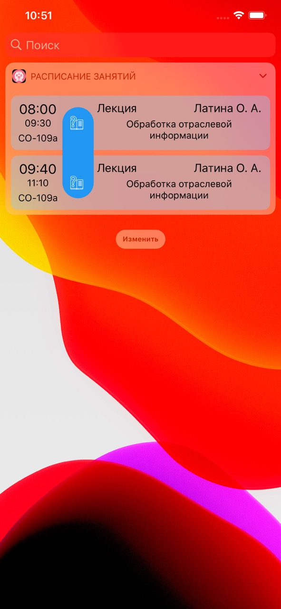
</p>

<p float="left">
    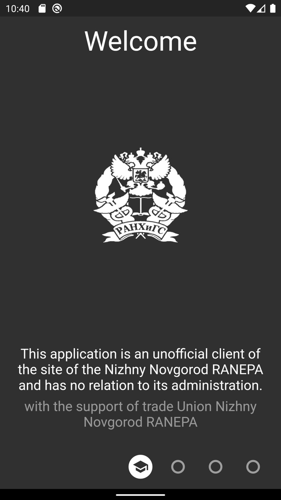
    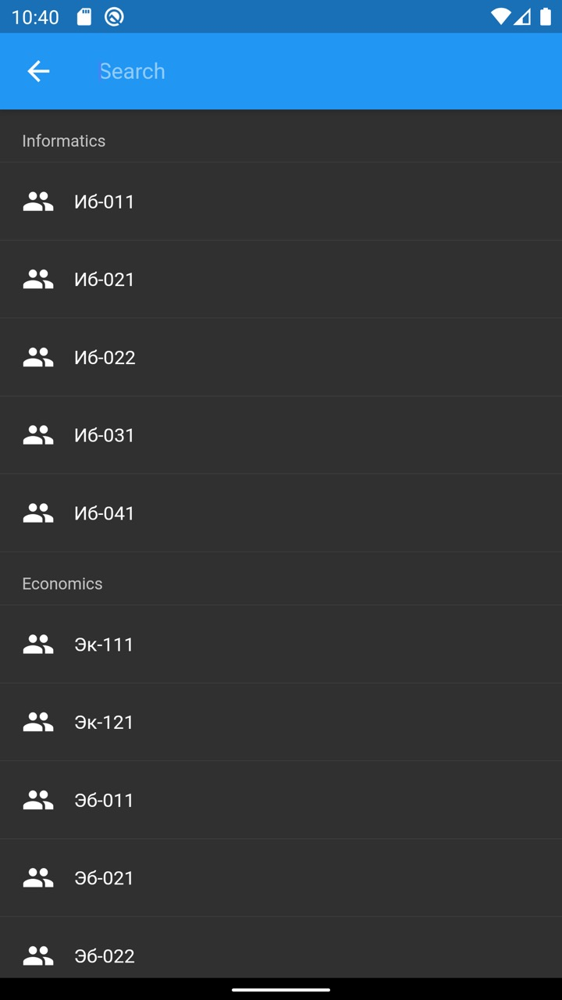
    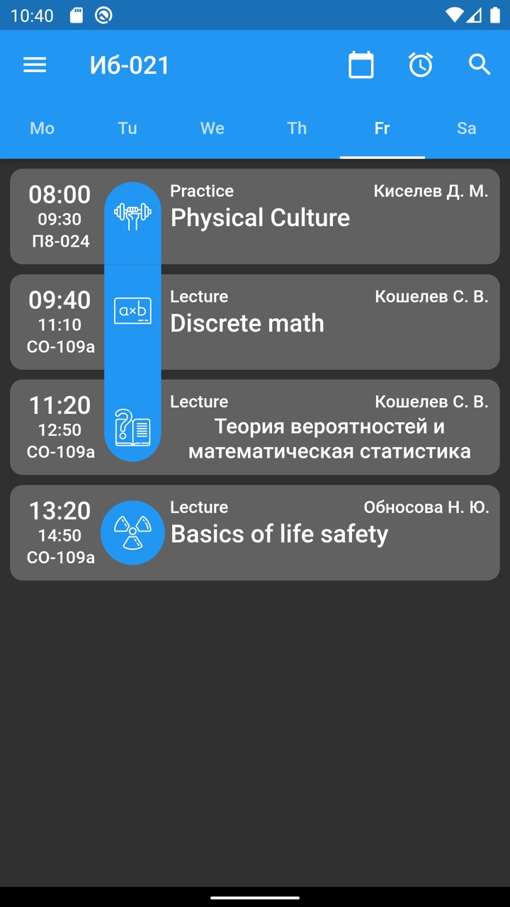
    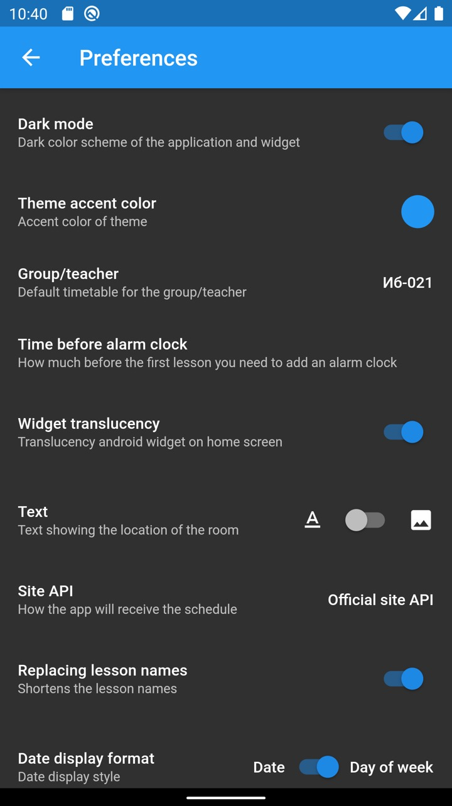
    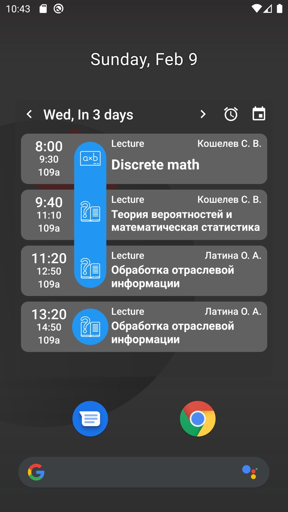
</p>

<p float="left">
    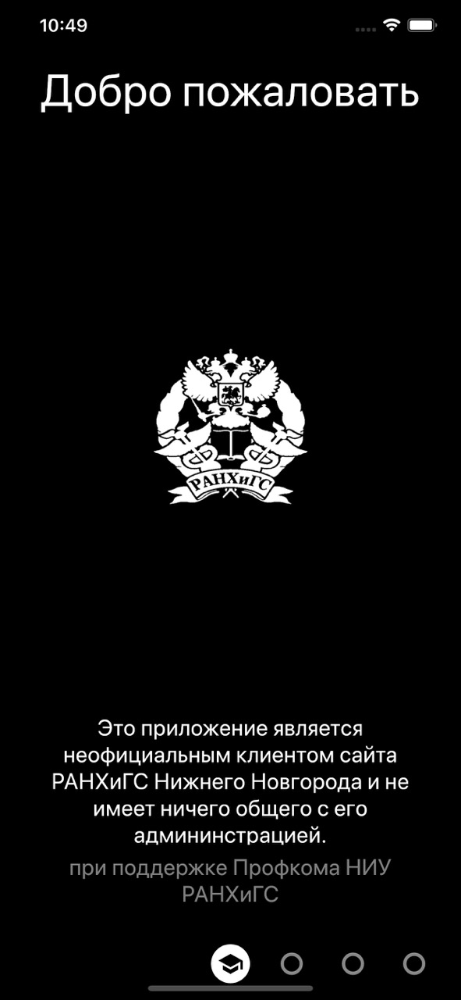
    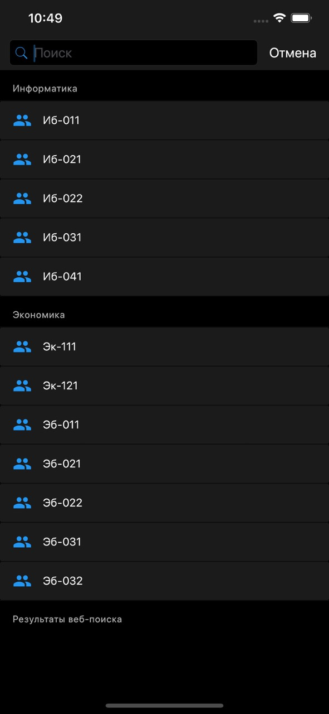
    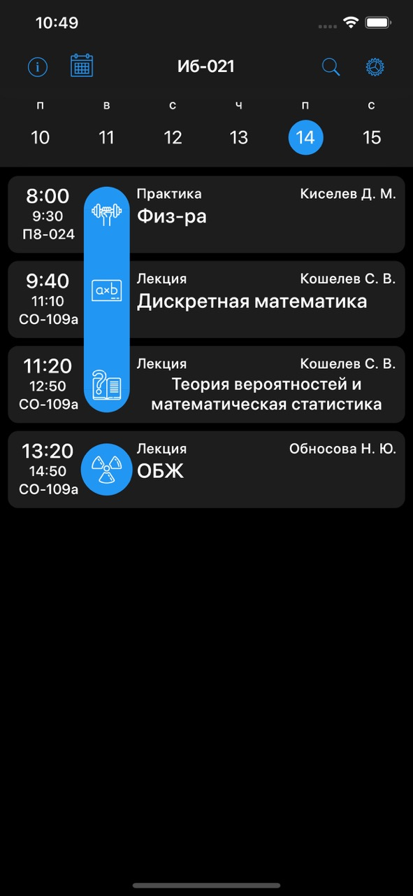
    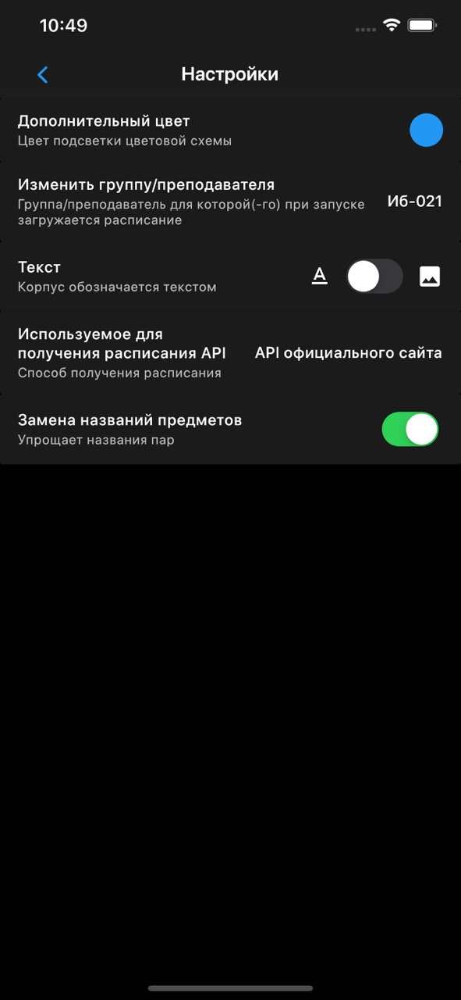
    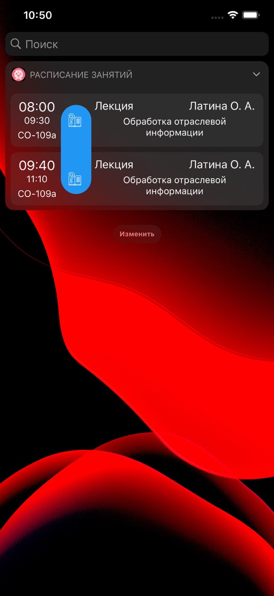
</p>

[![AppStore][appstore-image]][appstore-url]
[![PlayStore][playstore-image]][playstore-url]

## Getting Started

For help getting started with Flutter, view our online [documentation](https://flutter.io/).

## Project setup

### Android:

1. Create key.properties to /android with:

```
storePassword=# STORE PASSWORD #
keyPassword=# KEY PASSWORD #
keyAlias=# KEY ALIAS #
storeFile=/path/to/keystore/# FILENAME #.keystore
```

### iOS:

1. Get carthage deps in /ios folder
```sh
cd ios
carthage update --platform iOS
```

## References, used in the development

[Localization](https://proandroiddev.com/flutter-localization-step-by-step-30f95d06018d) flutter app

[Icons](https://pub.dartlang.org/packages/flutter_launcher_icons#-installing-tab-) for IOS/Android versions for Flutter app

## Useful commands

### Regenerate .arb translations files
```Shell
flutter pub pub run intl_translation:extract_to_arb --output-dir=lib/l10n lib/localizations.dart
```

### Regenerate translations classes
```Shell
flutter pub pub run intl_translation:generate_from_arb --output-dir=lib/l10n --no-use-deferred-loading lib/localizations.dart lib/l10n/intl_messages.arb lib/l10n/intl_ru.arb
```

### Regenerate icons
```Shell
flutter pub pub run flutter_launcher_icons:main
```

### Regenerate all json serialized .g.dart files
```Shell
flutter packages pub run build_runner build --delete-conflicting-outputs
```

[appstore-image]: https://itsallwidgets.com/images/apple.png
[playstore-image]: https://itsallwidgets.com/images/google.png

[appstore-url]: https://apps.apple.com/us/app/niu-ranepa/id6450411256
[playstore-url]: https://play.google.com/store/apps/details?id=ru.coolone.ranepatimetable
